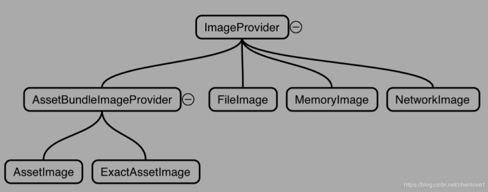

# Image

## 介绍

image是一个图片显示的widget，在功能上，它与Android原生控件ImageView相似，
但是，它又带有一些图片加载库（比如Glide）的功能，不但能加载项目中的资源文件，还能对本地图片及网络图片进行加载。

## 构造函数

Image 继承自 StatefulWidget，有5个构造方法：

|方法|解释|
|---|---|
|Image()	|通用方法，使用ImageProvider实现，以下4个方法本质上也是使用的这个方法|
|Image.asset	|加载资源图片|
|Image.file	|加载本地图片文件|
|Image.network	|加载网络图片|
|Image.memory	|加载Uint8List资源图片|



## 常用属性

从基础构造函数  
```dart
  const Image({
    Key key,
    @required this.image,
    this.semanticLabel,
    this.excludeFromSemantics = false,
    this.width,
    this.height,
    this.color,
    this.colorBlendMode,
    this.fit,
    this.alignment = Alignment.center,
    this.repeat = ImageRepeat.noRepeat,
    this.centerSlice,
    this.matchTextDirection = false,
    this.gaplessPlayback = false,
    this.filterQuality = FilterQuality.low,
  }) : assert(image != null),
       assert(alignment != null),
       assert(repeat != null),
       assert(filterQuality != null),
       assert(matchTextDirection != null),
       super(key: key);
```


中可以看到Image的属性（参数），以及其限制。下面对一些重要属性进行了说明：

### ImageProvider image

image参数需要传入一个不为空的ImageProvider类型，而ImageProvider是一个抽象类，也就是说，此处需要传入一个ImageProvider的实现类。
ImageProvider用于获取Image需要显示的图片，Flutter sdk已经给我们提供了5个ImageProvider的实现类：  

1. ExactAssetImage(name, bundle: bundle, scale: scale, package: package)
2. AssetImage(name, bundle: bundle, package: package)
3. NetworkImage(String url, Double scale, Map<String, String> headers)
4. FileImage(File file, Double scale)
5. MemoryImage(Uint8List bytes, double scale)

这5个实现类，包括了从资源、网络、文件、内存中获取图片，涵盖日常使用的大部分情况,
其它有特殊要求的情况可以继承ImageProvider根据实际实现其图片数据流获取方法：
```
ImageStream resolve(ImageConfiguration configuration)
```

### double width & double height

width和height两个属性不用多说，分别定义Image的宽和高，但是这里值得注意的是这两个参数是可选的，在不传这两个参数时，
Image为图片的原始大小（图片大小小于父组件，子组件的大小受限于父组件的大小）；只传其中一个参数时，会按对应边长进行等比例缩放

### BoxFit fit

刚刚说到width和height可以控制图片的宽高，但是，我们代码开发过程中设置宽高比例，和实际的图片资源的宽高比例，经常不一样。
这时，就轮到fit属性出场了：设置图片的填充方式。
在Flutter中，官方提供了7中填充方式供我们选择：

|类型|描述|
|---|---|
|BoxFit.fill|全图显示，显示可能拉伸，充满|
|BoxFit.contain|全图显示，显示原比例，不需充满|
|BoxFit.cover|显示可能拉伸，可能裁剪，充满|
|BoxFit.fitWidth|显示可能拉伸，可能裁剪，宽度充满|
|BoxFit.fitHeight|显示可能拉伸，可能裁剪，高度充满|
|BoxFit.none|无填充（不显示图片）|
|BoxFit.scaleDown|效果和contain差不多,但是此属性不允许显示超过源图片大小，可小不可大|

注意：此属性与centerSlice不能共用

### Color color & BlendMode colorBlendMode

color和colorBlendMode是配合使用的，单独使用无法生效，Blend是混合的意思，colorBlendMode就是颜色混合模式。
其原理和Xfermode很像


### AlignmentGeometry alignment

alignment是控制图片摆放位置的属性，默认为center

### ImageRepeat repeat

repeat用于控制未填满的部分如何显示，有不显示、X轴方向铺满、Y轴方向上铺满、XY轴都铺满

### Rect centerSlice

centerSlice有点像点九图的功能，就是定义拉伸区域，当图片需要被拉伸时，被定义的区域就会被拉伸。
注意：此属性与fit不能共用

### bool matchTextDirection

matchTextDirection一般与Directionality配合使用，用于匹配文字方向

### bool gaplessPlayback

当ImageProvider发生变化后（改变图片），在加载新图片时，是否保留旧图片。值为false时，加载新图片时，会直接空白等待新图片的加载

## 使用示例

```dart
class ImageStatelessDemo extends StatelessWidget {
  @override
  Widget build(BuildContext context) {
    return Scaffold(
      appBar: AppBar(
        title: Text("无状态图片"),
      ),
      body: Center(
        child: Image(
          image: AssetImage('images/logo.png'),
          width: 300,
          height: 300,
          //对齐方式 参数：-1.0，0，1.0
          alignment: Alignment(0, 0),
          //拉伸填充的区域，相当于在图片内部设置了一个.9图，但是需要注意的是，要在显示图片
          //的大小大于原图的情况下才可以使用这个属性，要不然会报错。与fit不能共用
//          centerSlice: Rect.fromCircle(center: Offset(100, 100), radius: 10.0),
          color: Color(0x99345678), //要混合的颜色
          colorBlendMode: BlendMode.xor, //混合的模式
          excludeFromSemantics: true, //??
          filterQuality: FilterQuality.high, //图片质量？
//          fit: BoxFit.cover, //图片填充模式 与centerSlice不能共用
//            frameBuilder:,//已被排除
//            loadingBuilder:,//已被排除

          //无间隙切换，当image provider 发生变化时，显示新图片的过程中，
          // 如果true则保留旧图片直至显示出新图片为止；如果false，则显示新图片的过程中，空白，不保留旧图片。
          gaplessPlayback:true,

          matchTextDirection: true, //匹配文字方向，一般与TextDirection一起使用

          repeat: ImageRepeat.repeat, //未填满的部分如何显示

          semanticLabel: "sssssssssssssss", //图片描述,不会被显示，
        ),
      ),
    );
  }
}

```

